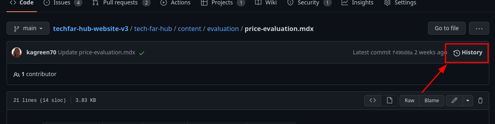

# Github for content editors

While github isn't exactly meant for content entry, by adding an interface to [git](https://git-scm.com/) and a text editor, it does a serviceable job as our CMS. Below, we'll cover a couple core git concepts that you'll need for updating TechFAR Hub (and most any other static site that uses github pages). Specifically, we'll cover:

-  Commits: The basic unit 
-  Branches: A way of keeping all of your edits together and previewing them before they go live
-  Pull requests
-  Actions
-  The editor

## Commits

A _commit_ is a set of changes on github. When you update a file through the website, you'll see a form at the bottom that says "Commit changes"

You can put a meaningful message in there so that in the future, when someone is trying to understand _why_ you made a change, there's a record. You can also see all the records of for a given page by clicking `History` at the top of a page:

