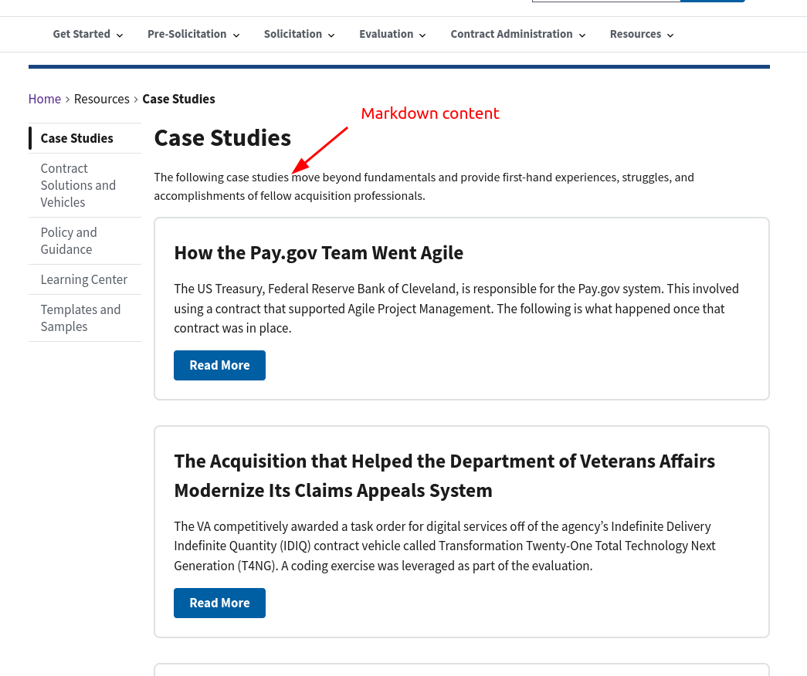

# Page Templates <!-- omit in toc -->

Page templates control how the page looks and how features like local navigation work. Outside of the homepage and the resources page, which are special cases, almost all of the pages have the same layout:

* A "left rail" that contains local navigation and tags (if any)
* A "main well" that contains the content

The site has the following templates available:

* `default`: If you don't set a `template:` in the frontmatter, the site will use this one. It generates local navigation based on the other pages in the same folder as the page you're on, and also links to every second-level heading (`##`) on the page. The content in the markdown files you edit goes in the content well.
* `lifecycle`: Almost identical to the `default` template, but adds a "Next" link at the bottom of the page to the "next" page by [`nav_weight`](frontmatter.md#nav_weight)

    
* `case-study`: The case study template is similar to the default template, but it **does not** generate links to sibling pages in the left rail. Instead, the local navigation is only to the second-level headings on the page.
  
    
* `listing`: The listing templates are used to list all of the content in a folder, using the `heading:` and `promo_description:` to generate links to each child page in the folder. The local navigation of a listing page is its siblings --- so other folders at its level. Listing pages can also have content from a markdown file at the top:
    

* `resources-landing`: A one-off page that is custom designed to layout the resources landing page. You'll likely never set this as a `template:`
* homepage: this is technically not a template you can set. The homepage is entirely custom code.
