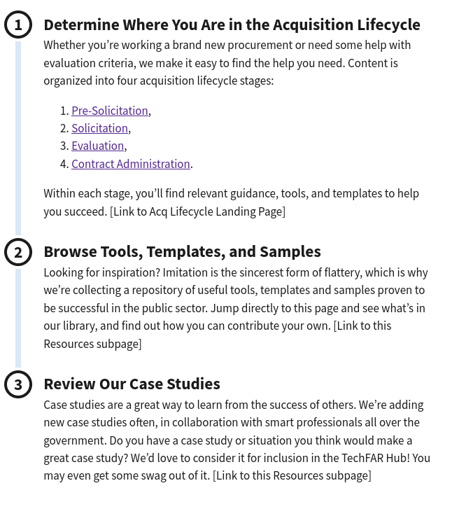
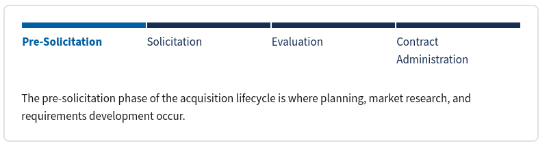
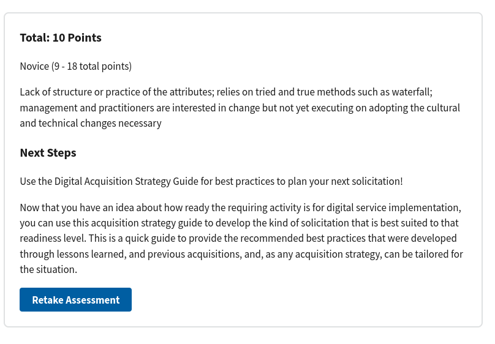

# Advanced Components <!-- omit in toc -->

When we said the site uses [markdown](basic-markdown.md) on those other pages, we fibbed a little --- the site uses a superset of markdown called [MDX](https://mdxjs.com/), which allows us to add special "components" to our pages to make them look more interesting or to include interactive elements.

Because components require more care to use than the rest of the markdown, we've tried to keep them as simple as we can manage --- in general, a component will simply be a wrapper around a list, and it will use the list to figure out its content. The general form for components looks like

```markdown
<ComponentName>
- A heading or link or something

    The content contained under that heading or link or whatever
- The next heading or link

    The content for that next heading or link

</ComponentName>
```

The thing to notice in the above are the "tags", which start with `<` and end with `>`. Each component starts with an "opening tag," like `<ComponentName>` and terminate with a "closing tag," which is the component name prefixed by a forward slash: `</ComponentName>`. This tells the site where the component starts and stops --- you can think of them as fancy parentheses in a sentence.

We have the following custom components, listed in order of likelihood you'll want to use them:

- [Summary](#summary)
- [External Resource](#external-resource)
- [ProcessList](#processlist)
- [MultiStep](#multistep)
- [Assessment and AssessmentScore](#assessment-and-assessmentscore)


## Summary

The _Summary_ component allows you to summarize the main topics of a page at the top. This makes it easier for visitors to digest long pages. 

The majority of pages have a `<Summary></Summary>` section at the top. Summaries look like this:


A _Summary_ component can technically contain any markdown you want --- typically, on this site, they contain a bulleted list. The markdown for the above example looks like:

```markdown
<Summary>
- Agile software development is a method of software development that utilizes an iterative development process, designs services based on real user needs, and constantly improves software from user feedback.
- While not appropriate for all IT needs, when used appropriately, agile generally leads to better outcomes.
- It is possible to work collaboratively with a contractor, in the spirit of agile, while maintaining proper ethical boundaries, per FAR 9.504 and 9.505.
</Summary>
```

## External Resource

The `<ExternalResource></ExternalResource>` component allows you to include a list of links at the bottom of a page to direct visitors to additional information that might be related to the subject. They are used at the end of pages. They look like this:


An _External Resource_ is an unordered list with links under each bullet. They can have a custom heading and a custom image. The markup for the above component looks like:

```markdown
<ExternalResources heading="Additional resources" media="/assets/img/ux-indonesia-8mikJ83LmSQ-unsplash.jpg" media_alt="People working together">
- First Resource

    [Describe the resource](/learning-center/)

- Second Resource

    [Describe the resource and link it](/pre-solicitation/)


- Third resources

    [Describe the resource](/contract-administration/)

- Fourth resource

    [Describe the resource](/evaluation/)

</ExternalResources>
```

## ProcessList

A `<ProcessList></ProcessList>` breaks down a complex, ordered process into smaller steps. It looks like this on the site:



A process list contains an ordered list. The list items are the headings, and the content under them is, well, the content under the headings. Here's what the code looks like for the above one:

```markdown
<ProcessList>
1. Determine Where You Are in the Acquisition Lifecycle

    Whether you’re working a brand new procurement or need some help with evaluation criteria, we make it easy to find the help you need. Content is organized into four acquisition lifecycle stages: 

    1. [Pre-Solicitation](/pre-solicitation/),
    2. [Solicitation](/solicitation/), 
    3. [Evaluation](/evaluation/), 
    4. [Contract Administration](/contract-administration/). 
    
    Within each stage, you’ll find relevant guidance, tools, and templates to help you succeed.

2. Browse Tools, Templates, and Samples

    Looking for inspiration? Imitation is the sincerest form of flattery, which is why we’re collecting a repository of useful tools, templates and samples proven to be successful in the public sector. Jump directly to this page and see what’s in our library, and find out how you can contribute your own.

3. Review Our Case Studies

    Case studies are a great way to learn from the success of others. We’re adding new case studies often, in collaboration with smart professionals all over the government. Do you have a case study or situation you think would make a great case study? We’d love to consider it for inclusion in the TechFAR Hub! You may even get some swag out of it.
</ProcessList>
```

## MultiStep

The `<MultiStep></MultiStep>` is an interactive component that allows you to display multiple, related concepts in a single area. It looks like this:



Each bold item at the top is clickable.

The markdown is very similar to the [_ProcessList_](#processlist) --- the core is an ordered list, where the headings are the list items and the content is the content under the list item. To create one like the above, the markdown looks like

```markdown
<MultiStep>

1. Pre-Solicitation

    The pre-solicitation phase of the acquisition lifecycle is where planning, market research, and requirements development occur.

2. Solicitation

    After you’ve completed pre-solicitation activities, it’s time to solicit offers from industry during the solicitation phase.

3. Evaluation

   Offers are in and it’s time to select the contractor who is best suited for the job, based on the criteria you develop in the Evaluation phase of the acquisition lifecycle.

4. Contract Administration

    When you’ve completed all the pre-award activities, from acquisition planning through evaluation and award, it’s time to focus on delivery.

</MultiStep>
```


## Assessment and Assessment Score

The `<Assessment></Assessment>` component allows you to build a scored quiz/assessment to help visitors assess something they're working on. This is the most involved component, but it follows the same form as the others --- if you can make a process list, you can make a new assessment.

An _Assessment_ looks like this: 


The options are clickable, and as the visitor pages through using the "Next question" link, they're eventually brought to a score page that looks like 



Like most of the above custom components, assessments and assessment scores are built out of lists with content nested under them. Here is a simplified example, which we'll walk through below:

```markdown
<Assessment>
1. Transparency & Openness

    - Provides a  protected “space” (physical location or attitude) for innovation to happen
    - Intensive and frequent communication with the customer and/or end users of the system

    1. No adoption
    2. Awareness of topics with limited adoption
    3. Adopted some practices
    4. Clear adoption of most practices
    5. All practices adopted into organizational culture

2. Organizational Culture of Delivery

    - Empowered small teams with a focus on delivering quality solutions
    - It is a practiced tactic to fail or succeed fast, and know what to do as a result

    1. No adoption
    2. Awareness of topics with limited adoption
    3. Adopted some practices
    4. Clear adoption of most practices
    5. All practices adopted into organizational culture

<AssessmentScore>
1. Novice (9 - 18 total points)

    Lack of structure or practice of the attributes; relies on tried and true methods such as waterfall; management and practitioners are interested in change but not yet executing on adopting the cultural and technical changes necessary

2. Intermediate (19 - 36 total points)

    Begins implementing changes to governance and culture to adopt of model attributes as repeatable processes; starting to qualitatively track metrics and apply lessons learned

3. Expert (37 - 45 total points)

    Embodies the model attributes, continually refining and optimizing team efforts; proactively building & investing in continuous delivery with end users

### Next Steps
Use the Digital Acquisition Strategy Guide for best practices to plan your next solicitation!
</AssessmentScore>

</Assessment>
```

A few things might jump out immediately:

- There are actually two components here, one nested in the other:
  - The `<Assessment></Assessment>`, which contains the questions/answers and the `<AssessmentScore></AssessmentScore>`
- It's mostly a bunch of nested lists

For the questions, the structure is as follows:

```markdown
1. The question heading is the list item

    - Any information you want to put under the heading to explain the question goes in bullets under the first list item
    - You can have as many or as few of these as you want.
    - The options will come after

    1. Options have a score equal to their position
    2. So, this option will be worth two points
    3. And this one three
```

You can have as many questions as you'd like, and questions don't have to have the same number of options, assuming you can make the rubric work.

After all the questions comes the `<AssessmentScore></AssessmentScore>`, which needs to be the last element in the _Assessment_. It again contains at least one ordered list. The list items need to be structured as follows:

1. A word to describe the score
2. An opening parenthesis
3. A range of points, separated by a hyphen
4. The words "total points"
5. A closing parenthesis
6. Any explanatory text you want about the score as a child of the list item 

So, a given score range looks like:

```markdown

1. Novice (9 - 18 total points)

    Lack of structure or practice of the attributes; relies on tried and true methods such as waterfall; management and practitioners are interested in change but not yet executing on adopting the cultural and technical changes necessary
```

You can then have whatever text you want under the scores, and you can have as many ranges as you want. It's up to you to ensure they don't overlap --- if they do overlap, the behavior may not be what you want.

After the score, remember to close the `</Assessment>` tag.
