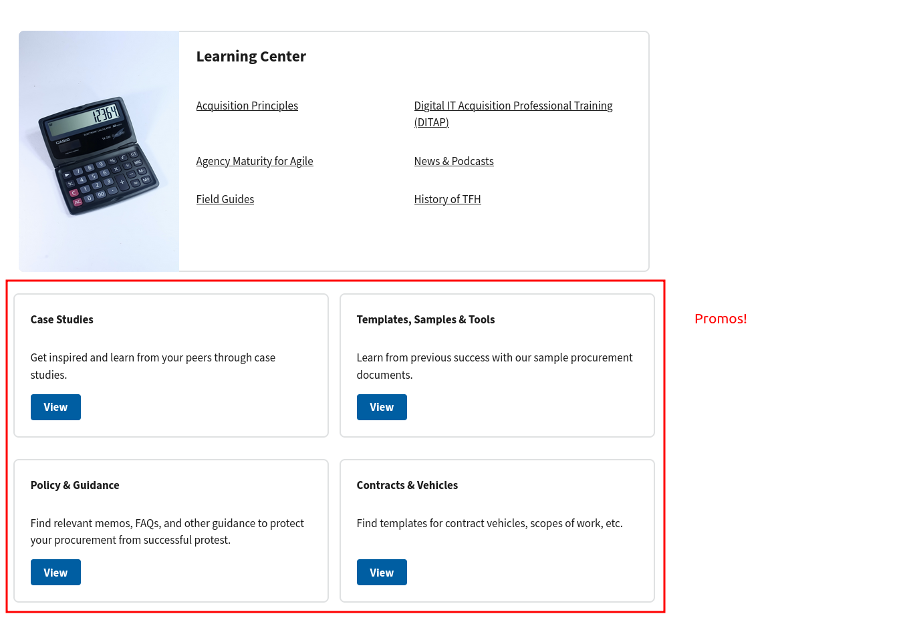
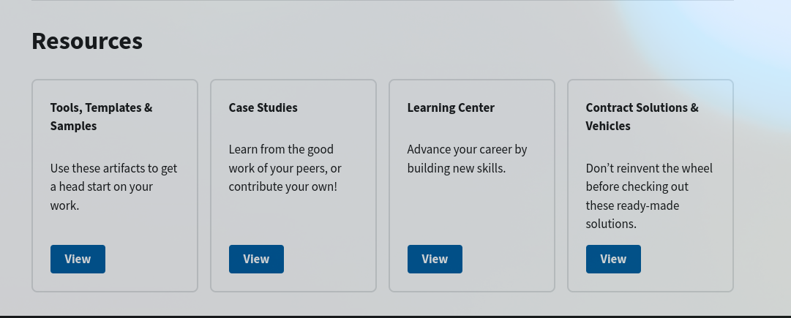
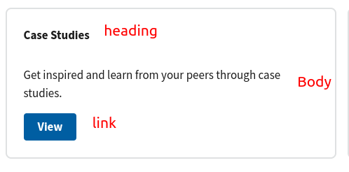
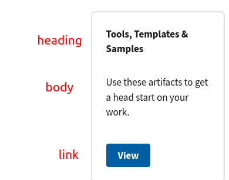

# Promos

For elements of the site that repeat across pages or that need  to be composed together to make a page, the site has the concept of _promos_. For the site editor, these are markdown files that contain part of a page. The [homepage is made up entirely of promos](the-homepage.md). The bottom half of the resources page are four promos:



Additionally, between the content and the footer of every page are the four "resources" promos:



All of these are controlled via markdown files in [`content/promos`](https://github.com/usds/techfar-hub-website-v3/tree/main/tech-far-hub/content/promos)


## The homepage

Because the homepage has a whole page about how it is built, please [read about editing the homepage](the-homepage.md) there.

## The resources page

The [top half of the resources page is a markdown file](https://github.com/usds/techfar-hub-website-v3/blob/main/tech-far-hub/content/resources/index.mdx?plain=1) that should look reasonably familiar. The bottom is controlled by the four markdown files in [`content/promos/resources-home`](https://github.com/usds/techfar-hub-website-v3/tree/main/tech-far-hub/content/promos/resources-home)

They are each substantially the same. Looking at [`case-studies.md`](https://github.com/usds/techfar-hub-website-v3/blob/main/tech-far-hub/content/promos/resources-home/case-studies.md?plain=1) as an example:

```yaml
---
heading: Case Studies
link: /resources/case-studies
nav_weight: 10
visible: true
---

Learn from the good work of your peers, or contribute your own!
```

This is a slight elaboration on the data used by [aliases](static-files-and-aliases.md) elsewhere on the site:

- `heading` is the heading that shows at the top of the box
- `link` is the (relative) URL of the page you're linking to from the promo's "View" button.
- `nav_weight` determines the order of the promos
- `visible` lets you temporarily hide a promo without deleting the file

The markdown content after the frontmatter shows up between the heading and the view button:



## Resource promos

The resource promos at the bottom of content pages are almost identical in structure to the ones on the resources home page. They are in [`content/promos/resources`](https://github.com/usds/techfar-hub-website-v3/tree/main/tech-far-hub/content/promos/resources). The case studies promo there looks like

```yaml
---
heading: Case Studies
link: /resources/case-studies
nav_weight: 20
visible: true
---

Learn from the good work of your peers, or contribute your own!
```

Just like the above, the fields mean

- `heading` is the heading that shows at the top of the box
- `link` is the (relative) URL of the page you're linking to from the promo's "View" button.
- `nav_weight` determines the order of the promos
- `visible` lets you temporarily hide a promo without deleting the file

