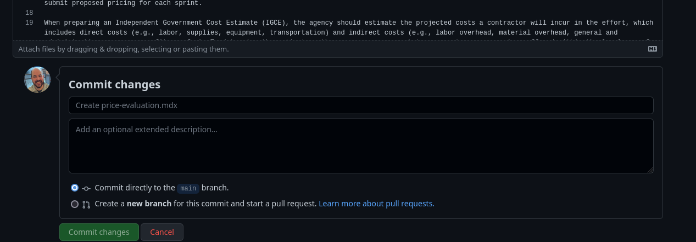
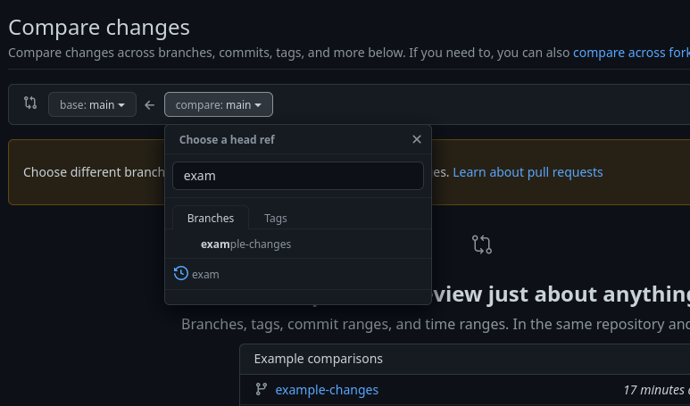
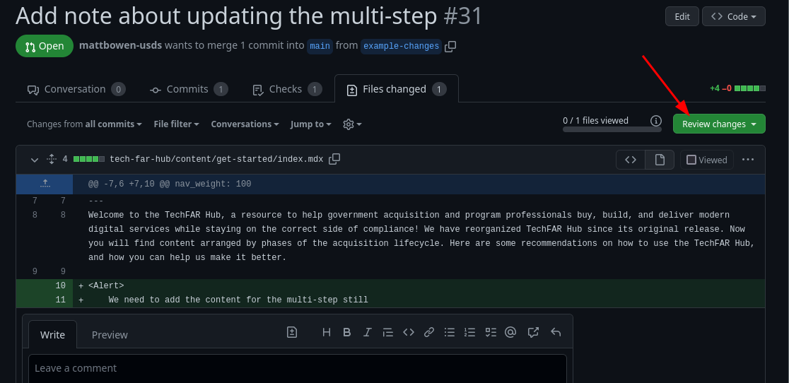
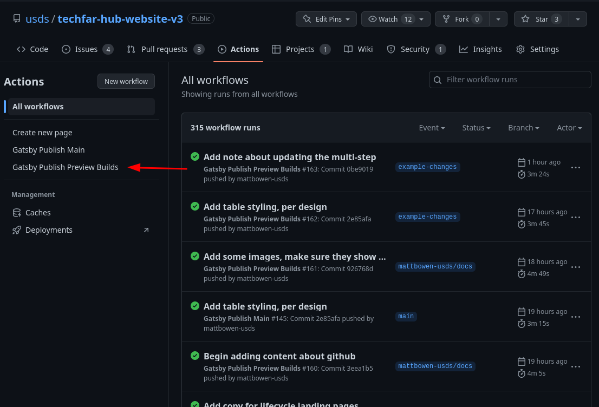

# Github for content editors

While github isn't exactly meant for content entry, by adding an interface to [git](https://git-scm.com/) and a text editor, it does a serviceable job as our CMS. Below, we'll cover a couple core git concepts that you'll need for updating TechFAR Hub (and most any other static site that uses github pages). Specifically, we'll cover:

-  [Commits](#commits): The basic unit of changes on github]
-  [Branches](#branches): A way of keeping all of your edits together and previewing them before they go live
-  [Pull requests](#pull-requests): A way of comparing the changes between two branches and getting feedback
-  [The editor](#the-editor): The text editor thing built into github
-  [Actions](#actions): The system we use to automate adding pages and creating the actual website

Note that this explanation is targeted at content editors, not engineers, so engineers, be cool about some of the details I'm glossing.

## Commits

A _commit_ is a set of changes on github, along with some useful information about the changes. When you update a file through the website, you'll see a form at the bottom that says "Commit changes"

You can put a meaningful message in there so that in the future, when someone is trying to understand _why_ you made a change, there's a record. You can also see all the records of for a given page by clicking `History` at the top of a page:

That said, if you don't want to put a meaningful message in, github will write a generic one for you. YOLO after all.

The commit also stores _when_ the commit was made and who made it.

**For normal humans working on this site, there are only three things you really need to understand about commits:**

1. A commit can have a comment on it. We have an [action](#actions) that will add a comment to your commits with where to see a preview version of the site with them.

    
2. While that preview version of the site is building, a little yellow dot will show up next to your commit message. When it's done, the dot turns green --- you might need to reload though to see the change:

    
3. Commits exist on one or more branches. However, you might not know what branches are yet, so...

## Branches

Branches are a way of naming a bunch of related commits. I think of them like a little fork in the history of a project, which you can join back into the main history with a [pull request](#pull-requests). The neat thing about a branch is you can collect a bunch of changes, see them in a preview of the site, get feedback on them through a pull request, and then have them go live all at once. Amusingly, this is something that a lot of CMSes have trouble with, so points to github.

Generally, you'll always want to create new pages or make edits on a branch --- github won't let most editors change main directly. If you are making a bunch of related edits, you don't need a branch per edit --- just make one branch, give it a good name, and make your edits to it.

Once all your edits are done, you will need them to be **merged** back into the main branch, which is what the live site is based on. This is done thought a [pull request](#pull-requests), described below.

### Making a branch

To make a branch, head to [the main repository](https://github.com/usds/techfar-hub-website-v3/tree/main). There, you'll see a dropdown that says "main":

Click that, and you'll get a dialogue that lets you select an existing branch or create a new one.

Give your branch a nice, descriptive name, unlike the one in this screenshot and then click the "Create branch: ..." link:

This will not only create the branch for you, but it will also select it so that your changes will be committed to that branch, instead of the main one. Now, you can make a bunch of changes and they'll all be collected together. When the system builds previews for you, it'll know that you made them on a branch and it will build a version of the site that takes your branch's changes into account even.

### Selecting an existing branch

This is similar to the above. If you're not already there, head to [the main repository](https://github.com/usds/techfar-hub-website-v3/tree/main). There, you'll see a dropdown that says "main":

Click that, and you'll get a dialogue that lets you select an existing branch or create a new one.

Start typing the name of a branch you're looking for, and then click it:

### A couple of special branches

There are two "special" branches on the site:

* **main** is the branch that turns into the actual live website at <https://techfarhub.usds.gov>. Generally, you can't directly commit changes to main, but instead need to make a branch and have it merge via a pull request into main.
* **gh-pages** is a special, system-created branch that contains the actual HTML of the website. You'll never need to even look at this, but I know USDSers are curious, so you'll probably find it at some point. 

## The Editor

Now that you've made a branch, you'll probably want to make some changes. Github has a basic but functional editor built in. 

1. First, be sure the branch you want is selected --- see [the above section](#selecting-an-existing-branch) if you skipped that and don't know what I'm talking about. 
2. Navigate to the file you want. You can either click through the web interface (clicking `tech-far-hub` -> `content` -> _the directory you want_ -> _the file you want_) or, if you want to feel like a hacker, hit the `t` key on your keyboard to bring up a file search.

    
3. You'll see a cool preview of the file, along with some data about who last edited it when. The key thing to notice is the little pencil icon above the file content. Click it.

    
4. Congrats! You're in a very simple text editor! You can now edit the text content with your wisdom and use [markdown](basic-markdown.md) and our [components](advanced-components.md) to make it engaging.

    

    If you're curious how your markdown will look, roughly, you can click the (nearly invisible) preview button to switch from editing to previewing. While this isn't a preview of how the page will look on the live site, it will show you if your lists are correct, your links are links, etc.
5. Once you've made your changes, you can [commit](#commits) your changes to save them! Now you see why we bored you with that part of this document.

    

Rinse and repeat until you've made all the changes you want.

## Pull requests

Once you have a branch full of changes you are happy with, you need to get it merged into the main branch so it can become part of the public website. As a measure of quality control, we require that a second person looks at your changes before they go live. This way you get feedback and proof-reading of your changes, and we know that at least one of your peers approves what you've written. The way we ensure this is through a **pull request,** also called a PR, which is a system built into github for getting feedback on changes and formally approving or rejecting the changes overall.

We're not going to exhaustively document how to comment on and interact with pull requests, since [github has good documentation about their pull request system](https://docs.github.com/en/pull-requests/collaborating-with-pull-requests/reviewing-changes-in-pull-requests/about-pull-request-reviews) already. However, we will cover the basics here.

### Creating a pull request

1. At the top of the repo in github, there's a bar of links --- click the one that says _Pull requests_

    
2. Click the green "new pull request" button

    

3. Leave the "base" as main, and compare your branch to it using the dropdowns. 

    

4. Once you've verified the changes are what you expect, click the green "Create pull request" button

    

5. Give your PR a descriptive title and description so folks know what you changed --- think of it as a summary of your changes. Then, click "Create pull request" again for like the third time (github wants you to be REALLY sure, apparently)

    

6. Let someone on the procurement team know you've created this pull request! They can then read the next section on commenting and approval.

### Review a Pull Request

Hopefully if you're reviewing a pull request, someone sent you a link. If not though, you can find them easily.

1. Just like creating a new pull request, at the top of the repo in github, there's a bar of links --- click the one that says _Pull requests_

    

2. Notice the list of pull requests and click the bold heading for the one you want to review.

    

3. Click the "Files changed" link above the PR's summary to see what's changed.

    

4. Read through the changes --- additions will be in **green** and removals will be in **red**. You can also see what downloads folks added and removed. You can add comments in-line by hovering your mouse over the line number and then clicking the blue `+` that appears

    
    

5. Once you've left your comments, at the top of the screen click the "Review changes" button. 

    

    It will give you three choices: Comment, Approve, or Request Changes. 
    
    
    
    If you generally would be okay with the changes going live whether your feedback is applied or not, _approve_. If you see something so egregious that you wouldn't want the changes going live without fixes, _request changes_. If you're just weighing in on the changes and someone else will approve/reject, or you're feeling passive aggressive, _comment._ 
    
    In all cases, you can leave a little note on the "Leave a comment" area that summarizes your feedback. When approving a PR, it's common to leave an encouraging emoji, like :1st_place_medal:. 
    
    **A pull request won't be able to be merged into main (and thus made live on the internet) until it has been approved.**

You can go back and forth as many times as you want with comments, requests for changes, etc. That said, be cool --- only ask for things that you think really matter or are true mistakes (typos, incorrect punctuation, factual errors). Otherwise, offer kind, constructive feedback on your peer's prose and approve what you can.

## Actions

Github's actions are how we automate things on the site. Currently, actions do three things for us:

1. Build previews of branches for our staging site by converting markdown into HTML and publishing it to github pages
2. Build the actual live website when new changes are merged into the `main` branch
3. Automate creating new pages

The first two actions run automatically when they need to --- whenever you add a new commit to a branch, or whenever a branch merges into main (respectively). The third is a manual step that you can read about in [the tutorial on creating new pages](tutorial-adding-new.md).

### Seeing what went wrong in an action

The one time you might need to interact with the automatic actions is if something goes wrong. Github will email you that a "build failed." You can see it by either clicking the link, or by clicking "actions" at the top of the repo: 

The action that probably failed for you is called "Gatsby Publish Preview Builds" and is available in the left nav:

Look for the run with a red X next to it and click the title

This will bring you to the build status page. In the box "annotations," you'll see a red X next to build. Click the word _build_:

This will bring you to a big, long error message. In there should be the URL of the page that failed to build, and _maybe_ (although probably not) something useful about what went wrong. 

From here, look over your file and see if maybe you started a link but never closed it or have `**` floating around somewhere without the closing `**`. If you're stumped, ask a colleague or an engineer for help! Debugging your markdown is a skill that takes time to develop and improves with time.
