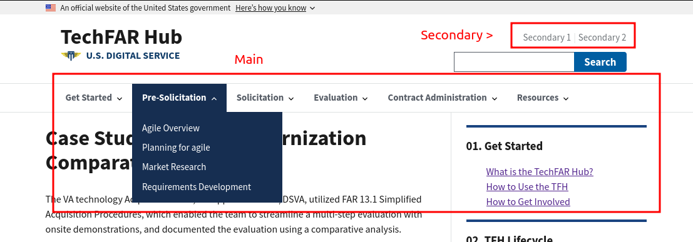

# Navigation<!-- omit in toc -->

TechFAR Hub has a couple different kinds of navigation that you might want to edit, so this page will cover all of them.

- [Global Navigation](#global-navigation)
  - [The main global navigation](#the-main-global-navigation)
  - [Secondary global navigation](#secondary-global-navigation)
  - [The footer](#the-footer)

The [Global Main Navigation](#global-main-navigation) and [The footer](#the-footer) are the same on every page and appear on every page, and they allow visitors to go from any part of the site to any other. They are manually controlled via [YAML files](https://learnxinyminutes.com/docs/yaml/) and can be edited by site editors.

If you've never heard of YAML, please don't be too nervous, since it's the same format as in the [frontmatter](frontmatter.md) and so you've already secretly been editing YAML and just didn't realize it.

The [Local, page-level navigation](#local-page-level-navigation) and [Tags](#tags) are contextual and are generated based on a page's content, template, and place in the directories on the site.

## Global Navigation

The global navigation appears at the top of every page and has two parts:

- the main global navigation, which are the dropdown menus
- the secondary global navigation, which are optional links that can appear above the search box



There are both controlled in [`content/compontents/main-nav.yaml`](https://github.com/usds/techfar-hub-website-v3/blob/main/tech-far-hub/content/components/global-nav.yaml)


All items in the global navigation are build up from _link stanzas_ that look like this:

```yaml
- heading: The link text
  link: /the/link/url
```

These stanzas appear in several places, but they are the heart of configuring navigation.


### The main global navigation

In [`content/compontents/main-nav.yaml`](https://github.com/usds/techfar-hub-website-v3/blob/main/tech-far-hub/content/components/main-nav.yaml), you will see a heading `mainGlobalNavigation:` and a series of stanzas indented under it that look like these:

```yaml
mainGlobalNavigation:
  - heading: Get Started
    link: /get-started/
    children:
      - heading: Get Started
        link: /get-started/
      - heading: How to Use TFH
        link: /get-started/#how-to-use-techfar-hub
      - heading: DITAP
        link: /get-started/ditap/
  - heading: Pre-Solicitation
    link: /pre-solicitation/
    children:
      - heading: Agile Overview
        link: /pre-solicitation/agile-overview/
      - heading: Planning for agile
        link: /pre-solicitation/planning-for-agile/
      - heading: Market Research
        link: /pre-solicitation/market-research/
      - heading: Requirements Development 
        link: /pre-solicitation/requirements-development/
```

Each dropdown of the main global navigation is a _link stanza_ that has `children`, which are just a list of link stanzas. The items in the dropdown are the `children`. Read these like an outline --- the indentation of a list 

While you can technically add another dropdown using this mechanism, you shouldn't; the design is setup for the number we have. You can, however, add, rephrase, and re-order links in the each dropdown by changing the `children` for a given dropdown.

### Secondary global navigation

After all of the configuration for the global navigation, there is a simple, two link configuration for `secondaryGlobalNavigation:` that, when filled out, looks like this:

```yaml
secondaryGlobalNavigation:  
     - heading: Secondary 1
       link: /url-for-secondary/link
     - heading: Secondary 2
       link: /second-url-for-second/link
```

It is a list of two links. Again, you could have more links, but it'll break the design, so just have two.

Note that, because it's optional, it might look like this:

```yaml
secondaryGlobalNavigation: []
```

The empty `[]` telling the system "this would be a list of links, but it's empty." If you want to add those links, delete the `[]` and add the two heading/link items indented like shown above.

### The footer

The footer is almost a combination of the above, although it has one unique feature --- the three social media links in the footer have a special form. 

In general, the footer's chunk of `global-nav.yaml` looks like:

```yaml
footerNavigation:
  facebookLink: "https://www.facebook.com/unitedstatesdigitalservice" 
  twitterLink: "https://twitter.com/USDS" 
  instagramLink: "https://www.instagram.com/usdigitalservice" 
  column1: 
    - heading: Get Started
      link: /get-started/
    - heading: Pre-Solicitation
      link: /pre-solicitation/
    - heading: Solicitation
      link: /solicitation/
```

The first three keys are, as they appear, the links to USDS's facebook, twitter, and instagram accounts. After that are three _column_ keys, one for each column on the desktop version of the footer:


As you might have surmised, the link stanzas under each of the column keys become the links in the footer. You can't add a column, but you can have as many links in each column as you want.

