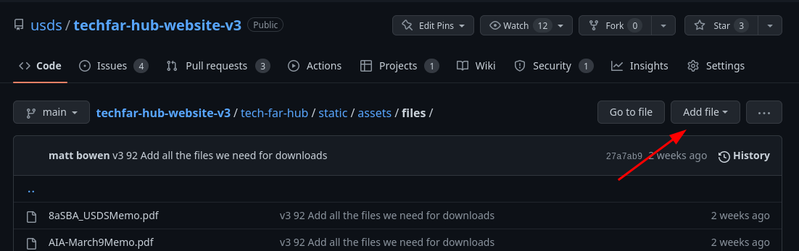
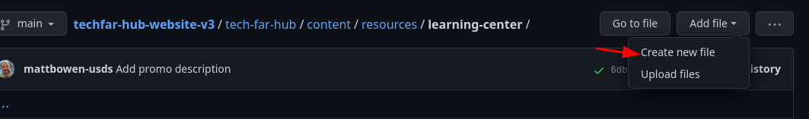
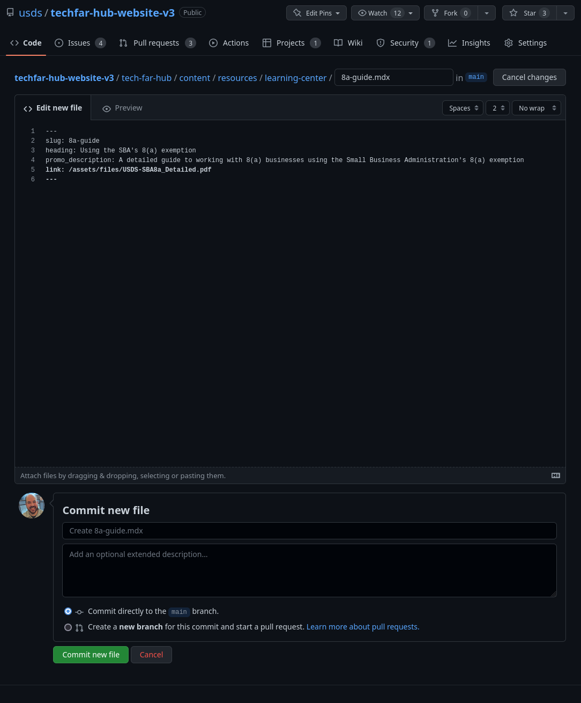

# Static Files and Aliases

It's common that we want to make some file available on the site for visitors to download. There are two steps to doing so, which vary based on how you want the download to show up on the site.

## Upload the file to github

In all cases, you'll need to upload the file to github. Navigate to [`tech-far-hub/static/assets/files`](https://github.com/usds/techfar-hub-website-v3/tree/main/tech-far-hub/static/assets/files) in your browser. Once there, you'll see a button to "Add file"



Click it, and then click "Upload files"


From here, you can drag files or select them using "Choose your files."


You'll need to set a commit message and click "Commit changes" at the bottom of the page to complete your upload.

## Decide how you want to link to the upload

You have two options for getting people to your download:

- With a link on an existing page
- Using an alias page (explained below)

### Using a link

To link to a file, you use a markdown link. The URL of the file will be the URL on github **after** the `/static/` part of the path. So, for the file `https://github.com/usds/techfar-hub-website-v3/blob/main/tech-far-hub/static/assets/files/USDS-SBA8a_Detailed.pdf`, the URL is `/assets/files/USDS-SBA8a_Detailed.pdf`. To write a link to this file, I'd add something like the following to a page:

```markdown
Download our [detailed guide to using the SBA's 8(a) exemption](/assets/files/USDS-SBA8a_Detailed.pdf`).
```

### Using an alias page

If you want the resource to show up on a listing page, such as _Learning Center_, you'll need to create an "alias" page. This way, the site will know what to call the file and what description to use. Assuming we wanted the above SBA 8(a) exemption guide to show up there, we'd 

- [make a new branch](github-for-content.md#branches)
- [navigate to the learning center folder on github](https://github.com/usds/techfar-hub-website-v3/tree/main/tech-far-hub/content/resources/learning-center)
- Click "Add file -> Create new file" on github

    
-Create a file named 8a-guide.mdx that has the following frontmatter:

    ```yaml
    ---
    slug: 8a-guide
    heading: Using the SBA's 8(a) exemption
    promo_description: A detailed guide to working with 8(a) businesses using the Small Business Administration's 8(a) exemption
    link: /assets/files/USDS-SBA8a_Detailed.pdf
    ---
    ```

    
- Write a commit message and commit the file

Note that your new markdown file does NOT need any content --- when users click the link on the site, they'll go directly to the download file.