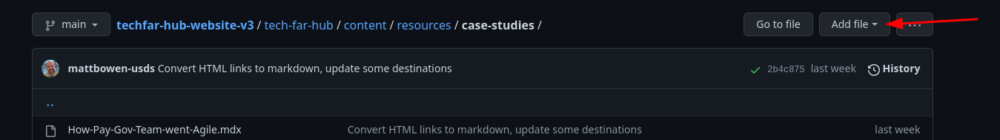
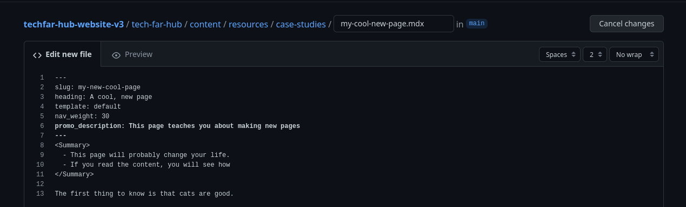

# Tutorial on adding new pages

This tutorial is largely a condensed version of [the github for content creators documentation](github-for-content.md), so if you read this and think "there must be more," go read that. It also is VERY similar to the [tutorial on editing existing content](tutorial-editing-existing.md), so if you're very familiar with that, you might want to skip to [adding a new mdx file](#adding-a-new-mdx-file).


## First, create a branch.

To make a branch, head to [the main repository](https://github.com/usds/techfar-hub-website-v3/tree/main). There, you'll see a dropdown that says "main":


Click that, and you'll get a dialogue that lets you select and existing branch or create a new one.


Give your branch a nice, descriptive name, unlike the one in this screenshot and then click the "Create branch: ..." link:


This will not only create the branch for you, but it will also select it so that your changes will be committed to that branch, instead of the main one.

## Adding a new MDX file

1. Navigate to the file you want. You can either click through the web interface (clicking `tech-far-hub` -> `content` -> _the directory you want_
2. Find the "Add file" button in the top and click it

    

    then click "Create new file

    
3. Give the file a that ends in `.mdx`.  **The file name must be all lower case and cannot contain spaces --- use hyphens instead of spaces.** So the name `Examples of Agile Team Members and Roles` should be `examples-of-agile-team-members-and-roles.mdx`
4. Add the key [frontmatter](frontmatter.md) to the file:

    ```yaml
    ---
    slug: my-new-cool-page
    heading: A cool, new page
    template: default
    nav_weight: 30
    promo_description: This page teaches you about making new pages
    ---
    ```
5. Add your copy using [markdown](basic-markdown.md)

    

6. Once you've made your changes, you can [commit](github-for-content.md#commits) your changes to save them! 

    

7. Wait for the preview build to complete and check your changes. You should get an email with the link to the version of the site built for your branch, and then you can navigate to the page you changed to see the changes live.


## Make a pull request

1. At the top of the repo in github, there's a bar of links --- click the one that says _Pull requests_

    
2. Click the green "new pull request" button

    

3. Make sure the base is _main_ and compare your branch to it using the dropdowns. 

    

4. Once you've verified the changes are what you expect, click the green "Create pull request" button

    

5. Give your PR a descriptive title and description so folks know what you changed --- think of it as a summary of your changes. Then, click "Create pull request" again for like the third time (github wants you to be REALLY sure, apparently)

    

6. Let someone on the procurement team know you've created this pull request! They can then read the next section on commenting and approval.

## Celebrate

Let someone in procurement know about your pull request and await their praise for your clever and clear writing.
