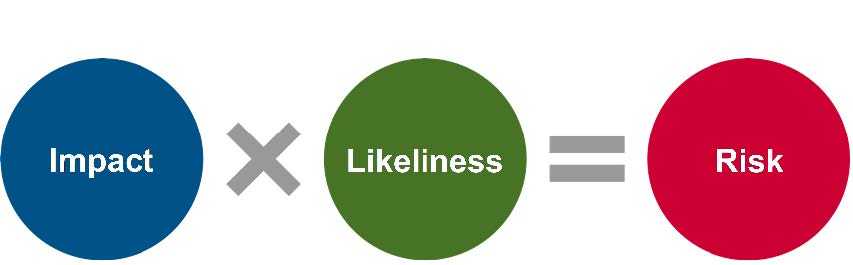

By Jacob Akervik

<Summary>
This case study was a finalist selected as part of the [Digital Acquisition Professional Program Case Study Challenge](https://www.challenge.gov/?challenge=ditap-case-study). To see the original case study, click [here](../../../../tech-far-hub/static/assets/files/so-you-want-to-replace-a-legacy-system-ditap-case-study.pdf).
</Summary>

## Student Scenario
### Your Role

You work for a medium-sized Federal department. You are a certified COR and/or P/PM, and even though you have experience, this is not your only job function. In your Department there is not always a large difference between the Contracting Officer Representative (COR) and Program/Project Manager (P/PM) roles. You are not in the Chief Information Office (CIO).

### What’s Happening

A business unit within your office came to your team with needs for a new IT system (custom-built) or service (Commercial Off the Shelf (COTS) or Software as a Service (SaaS)) to replace an aging legacy tool. You are not a Subject Matter Expert (SME) in that area.

The current tool was custom-built and has long been on an O&M (Operations and Maintenance) contract with no Development, Modernization, and Enhancement (DME) funding even though new needs have arisen since the tool was built several years ago. The current contract expires in six months. There is still one more six-month extension that could be exercised if leadership agrees, and your management needs to avoid any breaks in service. If there are any breaks in service, it will have critical impacts. The current provider is not a small business.

Your initial market research shows there are several potential offerors, a mix of large and small businesses. Some are policy experts who pair with IT subcontractors. Others have COTS/SaaS solutions geared toward state and local government needs related to the relevant programs and funding, but they have not worked with the Federal government before.

In this Department there’s no official centralized Project Management Office (PMO), so business units and P/PMs-CORs are expected to coordinate IT projects across the enterprise to include the business unit; the Acquisition/Procurement Office (APO); the Privacy Office (Privacy); and the aforementioned CIO, which includes the Cybersecurity Office (CyberSec); etc.

### The Icing on the Cake

Oh, and one final piece of information: your senior leadership wants Customer Experience (CX), Artificial Intelligence (AI), Cybersecurity (ATO, etc.), and Privacy (PIA, SORN, PII, etc.) addressed in all new IT systems and services plans, projects, and contracts.

P.S. Plus they want costs reduced under any new contract.

P.P.S. They also need to hit small business contracting targets this year.

### General Student Instructions
> [!CAUTION]
> For all exercises, take care not to disclose any sensitive, secret, or non-public information.

  - Unless your instructor provides different instructions, follow the exercise instructions.
  - Your final task is to use the information from the front matter and exercises to write the body of a 1–2 page options and recommendations memo to your leadership.

### Additional Notes from your Meetings

| Leadership | CIO |
| --- | --- |
| Wants this completed ASAP, preferably by the end of next FY | Will be required to ask OCIO for Development, Modernization, and Enhancement (DME) funding if you want a new custom system, which will require asking for money through the two-year Capital Planning and Investment Control (CPIC) process  |
| Thinks we already spend too much money on the current solution and that a new solution can be both better and cheaper; <ins>is this even possible?</ins> | If your office is willing to bring Operations and Maintenance (O&M) money from your Salaries and Expenses (S&E) to the table for a COTS/SaaS solution using O&M only, the project may be able to be accomplished sooner but will have fewer customizations |
| Wants to prioritize using a small, disadvantaged business provider |  |
| Your top senior leader is a consensus builder, and the team is split: half innovators (risk tolerant) and half bureaucrats (risk averse) |  |
| VERY focused on CX, AI, and DEI due to Executive Orders and risks |  |

| CyberSec | Business Unit |
| --- | --- |
| After procurement is complete, the Authority to Operate (ATO) will take four months if the solution is FedRAMP’d, six months if not | Is under a lot of pressure from leadership to get this done |
| Needs to know who you are planning to assign as Information Systems Security Officer (ISSO) | Doesn’t like their current system, but is also hesitant to go through the process of moving to a new solution due to fear of lack of resources, time to learn and train, etc. |

| Privacy | APO |
| --- | --- |
| Solution will contain Personally Identifiable Information (PII) | Not including the optional six-month extension, the time to complete a new acquisition will take nine months |
| The Privacy Impact Assessment (PIA) and System of Records Notice (SORN) processes will take approximately six months to complete from the end of the acquisition process | Acquisitions must be completed by then end of August because there is an end of FY/beginning of FY contracting blackout for year-end activities from September through October |
| Will any of this require a Paperwork Reduction Act (PRA) approval? |  |

| CX/AI | DEI |
| --- | --- |
| Find and read Executive Order 14058 | Accessibility (Section 508) is critical to any DEI and risk analyses for all new IT projects |
| What does Artificial Intelligence actually entail in practice? |  |

## Exercise 1: Choose your system or service and begin to assess your options
### Student Instructions:

Per your instructor, as individuals or as a team, you will either be assigned or choose a real or imagined scenario in which you begin to identify the various components of feasibility for an IT project to solve the business needs outlined.

For all options, assume and imagine your existing system is old, outdated, and only handles the basics compared to what a new solution could provide. The specifics are less important than the general idea that the new solution should (hopefully) be better and faster.
#### Options to consider:
  1. **Customer Relationship Management (CRM)** for tracking service requests, status, resolution, information from partners, stakeholders, and customers.
  2. **Enterprise Resource Planning (ERP)** for Departmental and/or office/program assets such as budget, finance, funding, grants, HR, infrastructure, etc.
  3. **Content Management System (CMS)** which helps edit and publish one or more external (internet) and/or internal (intranet) websites with multiple web pages.
  4. **Science, Technology, Engineering, Mathematics (STEM)** software and/or hardware.
  5. **Choose your own general or specific business need** which has a potential IT system or service solution.

Record your choice in a location and format you can easily access later.

## Exercise 2: Use a search engine to find three examples of this type of solution
*Example:* Find three popular solutions and/or solution providers. Can you also find at least one Federal government use example? E.g. Federal contract/contractor, FedRAMP, GWAC, etc.

| # | Solution Example  | Link/Source | In use by Federal government? |
| --- | --- | --- | --- |
| 1. |      |      |     |
| 2. |      |      |     |
| 3. |      |      |     |


## Exercise 3: Scope and Business Needs
### Student Instructions:

Assume the new solution will have a broader scope than the existing solution.

Fill in a chart like the one below by beginning to brainstorm potential answers to the following questions:

  - What’s are the potential or likely most important things these individuals or groups need or want out of a new solution?
  - What are the key pieces of information or data to consider for the different audiences?
  - What are the ways in which you might gather information about what each of these groups need or want out of a new solution?

#### Business Needs
| Audience| Primary Need(s)| Secondary Needs or Wants | Methods of Gathering Needs | Key Performance Indicators/ Target Demographics |
| --- | --- | --- | --- | --- | 
| Senior Leadership |      |     |     |     |
| Office/Program leadership |      |     |     |     |
| Partners, stakeholders, customers |      |     |     |     |
| End users |      |     |     |     |
| General Subject Matter Experts |      |     |     |     |
| Technologists (Tech SMEs), ex: IT, web, data, GIS, etc. |      |     |     |     |
| Other audiences |      |     |     |     |

## Exercise 4: Schedule, Cost, and Other Typical Variables
### Student Instructions:

As you begin to assess your options, answer the following questions about the various options compared to the current basic system:
  1. **Costs**: Will a new solution likely cost more, less, or the same?
  2. **Schedule**: How long will each option take to implement?
  3. **Budget**: If costs increase or Development, Modernization, and Enhancement (DME) funding is needed, where will this money be obtained and how long will it take?
  4. **Return on Investment**: Are there any ways in which ROI can be calculated? For example, how many Full Time Employees (FTE) does the current system replace?
  5. **Small/Disadvantaged Businesses**: Are there any 8(a) sole source options? If not, are there any GWAC solutions, like small businesses that resell the solution for a larger business?

#### Options
| Variables | Keep Current System| Upgrade Current System or New Custom System | Obtain New SaaS or COTS| 
| --- | --- | --- | --- | 
| Costs | Similar | Costs of DME and customization vs COTS/SaaS service and configuration | What will be lost without the ability to customize? |
| Schedule | Any advantages to recommending keeping? | How long does it take to upgrade or build a new system? | How long |
| Budget | Already budgeted for the next 12 months |DME requires justifications and time to obtain | O&M is faster but may not lead to as robust a solution |
| ROI | Status quo | Does customization save money or cost money in the long term? | Does a leaner but more rapid solution lead to a better outcome? |
| Small and Disadvantaged Business Options | Current provider not a small business | Can a small business handle what the larger business did? | Are there an adequate number of potential providers? | 

## Exercise 5: Risk, Innovation, and FedRAMP
### Student Instructions

Create a list of both positive and negative risks, along with the basic risk calculation, and answer the FedRAMP questions below.

Contrary to popular belief, not all risks are negative. Positive risk is often ignored, and can often be defined as the same as, or similar to, innovation.

From [FEMA.gov](https://emilms.fema.gov/is_0036a/groups/41.html#:~:text=Risk%20is%20the%20Impact%20rating,3%20x%205%20%3D%2015) 

> Risk is the Impact rating multiplied by Probability rating, with the resulting number as your Risk. Let’s say you live near a river and have experienced flooding in the past. You rated the Impact at 3 and the Probability at 5 so your Risk would be 15 (3 x 5 = 15). Go through your hazard list and multiply the Impact rating by the Probability rating.



  - Positive Example: A new email communication solution will be able to help us reach thousands more partners, stakeholders, and customers, which will have a high impact on our engagement reach and numbers.
  - Negative Example: The more our email distribution list grows, the greater our costs.

| Variables | Keep Current System| Upgrade Current System or New Custom System | Obtain New SaaS or COTS| 
| Risk Description | Impact (1=Low, to 5=High) | Likeliness (1=Low, to 5=High) | Impact x Likeliness = Risk (1 - 25) | Positive or Negative Risk? |
|     |     |     |     |     |

#### The Federal Risk and Authorization Management Program (FedRAMP&reg;)
  - Visit https://www.fedramp.gov/program-basics/. Go back to your original list from EXERCISE 2; are any of the examples you found FedRAMP authorized? https://marketplace.fedramp.gov/products
  - Why might it be beneficial to consider FedRAMP authorized solutions?

## Exercise 6: Artificial Intelligence
### Student Instructions

Explore the Federal AI use case inventory and either use the existing use cases; come up with your own; or a combination thereof. https://ai.gov/ai-use-cases/
Fill in at least three AI use cases for your potential solution.

| # | Use Case | Source | Description |
| --- | -- | -- | -- |
| 1. |     |    |     |
| 2. |     |    |     |
| 3. |     |    |     |

## Exercise 7: DEI or IDEA? 

While we often hear about the terms Diversity, Equity, and Inclusion (DEI), we don’t always include Accessibility in the discussion.

As it relates to technology, Accessibility is often tied to Section 508: https://www.section508.gov/

However, DEI, DEIA, IDEA, or whatever acronym we want to use, involves more in the technology realm than just ensuring that people who have visual or auditory impairments can utilize software or a website.

### Student Instructions
  - Review this article and report from the National Academies of Sciences, Engineering, and Medicine on **Advances in Facial Recognition Technology Have Outpaced Laws, Regulations; New Report Recommends Federal Government Take Action on Privacy, Equity, and Civil Liberties Concerns** https://www.nationalacademies.org/news/2024/01/advances-in-facial-recognition-technology-have-outpaced-laws-regulations-new-report-recommends-federal-government-take-action-on-privacy-equity-and-civil-liberties-concerns

Answer the following questions: 
  - Which Section 508 considerations do potential solutions need to consider?
  - What broader IDEA concerns might this or other new technology address or exacerbate?
  - Do any of the potential solutions I’ve found have Voluntary Product Accessibility Templates (VPATs)? If so, where did you find them?

## Final Exercise 8: Options and Recommendations Leadership Memo
### Student Instructions

Use the information from the prior exercises to construct a draft options and recommendation memo to your leadership. You should concentrate on the body of the memo.

The total length of the memo will not be more than two pages, so the body of the memo should not take up more than 1.5 pages to allow space for the memo header. Consider the following:

  - Should I place the top recommendation at the beginning or end of the memo?
  - How should I order the other options?
  - Should I include options that aren’t recommended?
  - Which pieces of information from each EXERCISE are worth including for leadership, and which are worth saving for a discussion or presentation?
  - Should any pieces of information, such as negative risks, be excluded?

Draft memo body notes in a format similar to the following:
```
Top Recommendation:

Options (ranked): 

Additional Recommendations:

Top notes from each exercise:
  1. 
  2. 
  3. 
  4. 
  5. 
  6. 
  7. 
  8. 
```

## Select Additional Resources
  - Federal Project Management: https://www.fai.gov/resources/toolkit 
  - Capital Planning and Investment Control (CPIC): https://www.cio.gov/policies-and-priorities/cpic/ 
  - The Executive Budget Process Timeline: In Brief Updated February 23, 2024: https://crsreports.congress.gov/product/pdf/R/R47088 
  - Agency-specific Acquisition Regulations: https://www.acquisition.gov/content/regulations 
  - GAO What are the Biggest Challenges to Federal Cybersecurity? (High Risk Update June 2024): https://www.gao.gov/blog/what-are-biggest-challenges-federal-cybersecurity-high-risk-update 
  - Customer Experience:
    - https://digital.gov/topics/customer-experience/ 
    - https://www.performance.gov/cx/ 
    - https://coe.gsa.gov/coe/customer-experience.html 
  - Artificial Intelligence:
    - https://www.opm.gov/data/resources/ai-guidance/ 
    - https://coe.gsa.gov/coe/ai-guide-for-government/introduction/ 
    - https://www.cio.gov/tags/artificial-intelligence/ 
  - Market Research https://www.gsa.gov/sell-to-government/step-1-learn-about-government-contracting/conduct-market-research
  -  Governmentwide Acquisition Contracts (GWACs): https://www.gsa.gov/technology/it-contract-vehicles-and-purchasing-programs/governmentwide-acquisition-contracts
  - DEIA Executive Order 13985: https://www.whitehouse.gov/briefing-room/presidential-actions/2021/06/25/executive-order-on-diversity-equity-inclusion-and-accessibility-in-the-federal-workforce/ 

## Student Notes/Questions/Answers

Please see page 11 of the [original case study](../../../../tech-far-hub/static/assets/files/so-you-want-to-replace-a-legacy-system-ditap-case-study.pdf) for a suggested notetaking format and resource.

## Instructor Guidance

> [!NOTE]
> This instructor guidance section is included on a separate last page so it can be more easily excluded from the file or printout for the student.

This case study is designed to allow for maximum flexibility and creativity for use across different individuals, teams, and groups in the Federal government.

For each relatively short exercise, a brief set of student guidance is provided in each section. The goal is to make each exercise reasonably short while also capturing an important component of the broad base of knowledge needed by Federal government Digital Information Acquisition Technology Professionals (DITAPs).

For anyone in Federal government, learning to write a quality options and recommendations memo for their boss or leadership is a key skill. The end goal of the exercises is to lead the students into that final exercise: writing the body of a memo to their leadership which gives their leadership options while also including a top recommendation. Students should be able to use pieces from each of the exercises preceding the final memo exercise to build their memo.

### Instructor Notes/Questions

Please see page 13 of the [original case study](../../../../tech-far-hub/static/assets/files/so-you-want-to-replace-a-legacy-system-ditap-case-study.pdf) for a suggested notetaking format and resource.


